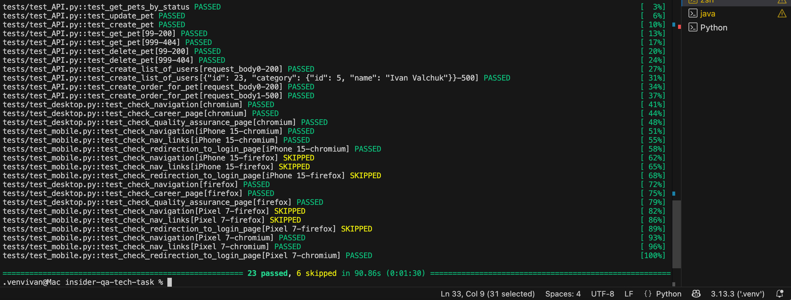
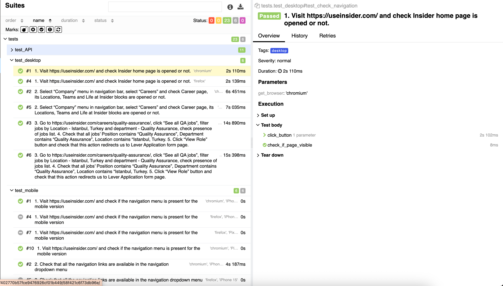
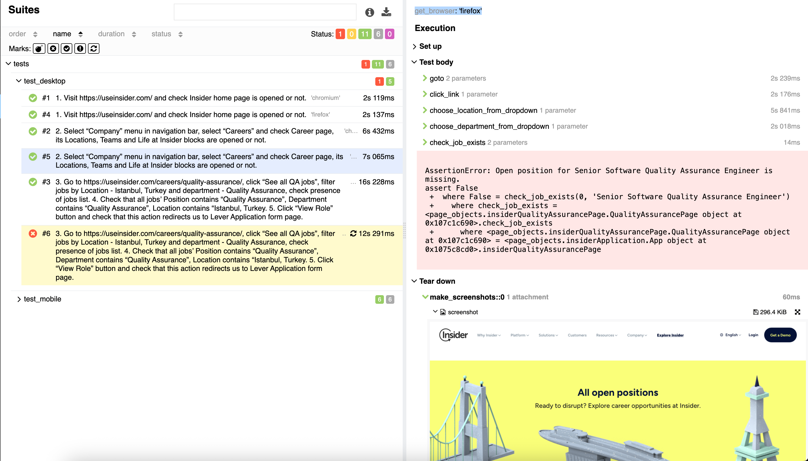
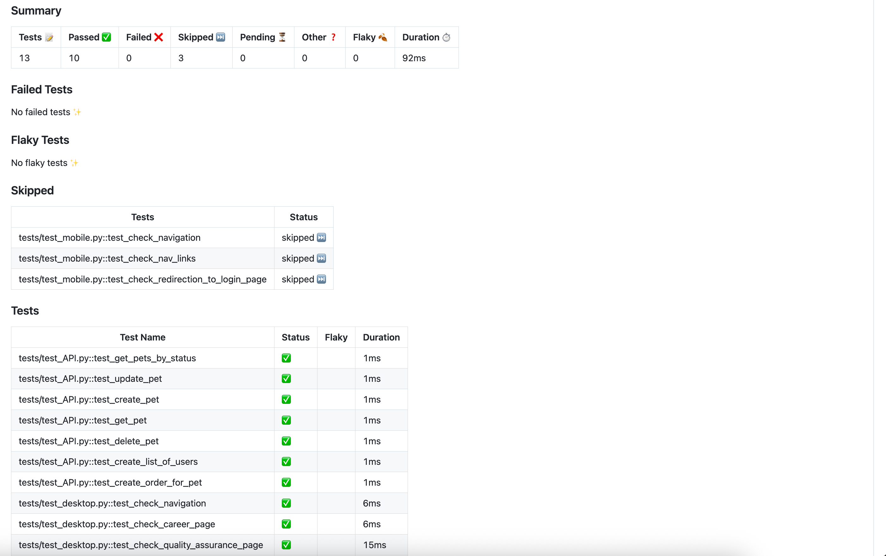

### The test cases have been automated using Playwright and Pytest using the Page Object Model for better maintainability.
### Below are the instructions on how to install the required libraries and run the tests.

#### Installation instructions
1. Download the latest Python version from https://www.python.org/downloads and install it (if not installed).
2. Download the latest version of Git from https://git-scm.com/downloads and install it (if not installed).
3. Install the Pytest plugin using pip install "pytest-playwright".
4. Install the Pytest browsers with "playwright install".

#### Repository setup
1. Clone the repository from https://github.com/ivanvalchuk/insider-qa-tech-task.git
2. "cd" to the folder "insider-qa-tech-task".
3. The tests are located as follows:
- "./tests/test_desktop.py" contains test cases for running on Desktop.
- "./tests/test_mobile.py" contains test cases for running on Mobile.
- "./tests/test_api.py" contains test cases for API.
4. Page objects can be found in the "./page_objects" folder.
5. Pytest fixtures can be checked out in the "./conftest.py" file.

#### Running intstructions
- "pytest" - runs the tests on Desktop browsers and mobile devices and performs API tests.
- "pytest -m desktop" - runs the tests on Desktop browsers (e.g. Chromium and Firefox).
- "pytest -m mobile" - runs the tests on emualated mobile devices (e.g. iPhone 15 and Pixel 7).
- "pytest -m api" - runs auto tests for API.

- "pytest -m desktop --lf" / "pytest -m mobile --lf" / "pytest -m api --lf" - re-runs the previous failed tests for Desktop / Mobile / API.
By default, the tests are run in the 'headed' mode and on Chromium, Firefox browsers on Desktop and iPhone 15 and Pixel 7. In order to change to the 'headless'  mode, please change this in "./pytest.ini" by setting 'headless' to 'True'. Adding support for other browsers (e.g. Webkit) and devices can be done in the "./conftest.py" file by adding them to the params of the corresponding fixtures, e.g. params = ['webkit'], params = ['iPhone 14', 'Galaxy S9+'].
For convenience, the tests are run in the slow mode, which can also be adjusted in the "./conftest.py" file by removing / modifying the value for "slow_mo" under the "get_browser" fixture.

#### How to set up reporting
1. Install the plugin for Allure reporting using "pip install allure-pytest".
2. Install Allure via "brew install allure" for Mac or check https://allurereport.org/docs/install for other operating systems.
3. "cd" to the folder "insider-qa-tech-task".
4. Run the command for generating the report: "allure serve report" and the report will be opened in a separate tab of the browser.

5. Screenshots for the failed tests are taken and recoded in the Allure report, which can be seen as follows:

#### CI
The tests are also run on each push and pull request to the respository in GitHub, which is configured in "playwright.yml" as part of the ".github/workflows" folder:

A generated test report through "GitHub" actions can be found under the "Actions" tab at https://github.com/ivanvalchuk/insider-qa-tech-task
   Click on a corresponding workflow run to see the details. 
